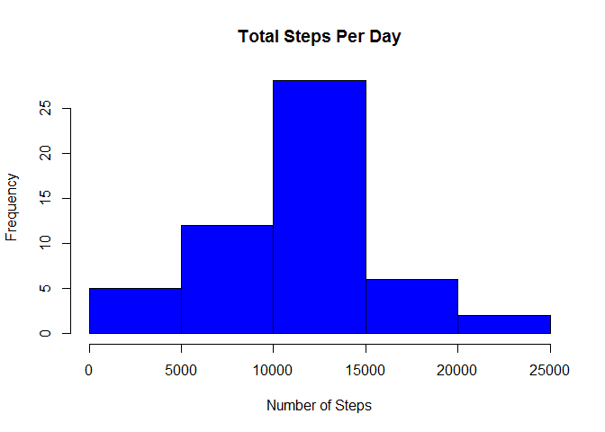
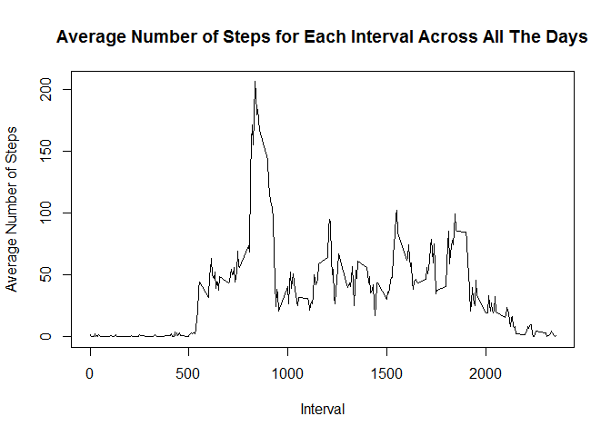
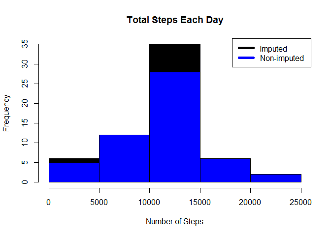
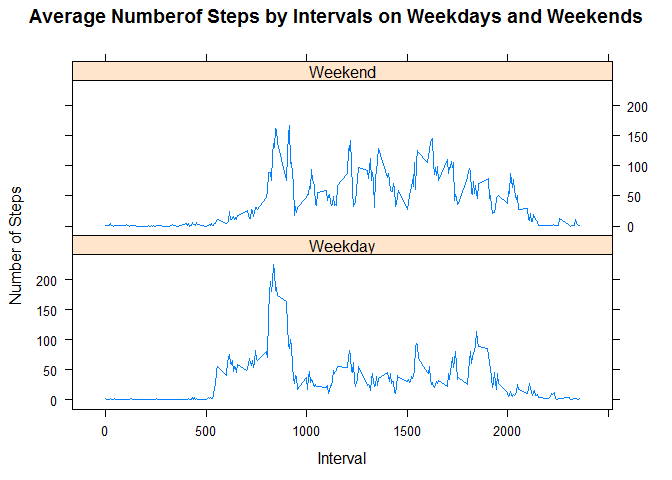

# Reproducible Research: Peer Assessment 1
Lai Hsun Hui  
Dec, 2014  

## Loading and preprocessing the data

Download, unzip and load data into data frame `data`. 

```r
file <- tempfile()
download.file("http://d396qusza40orc.cloudfront.net/repdata%2Fdata%2Factivity.zip",file)
unzip(file)
unlink(file)
data <- read.csv("activity.csv")
```

## What is mean total number of steps taken per day?

Create Histogram base on total steps per day, and calculate mean and median.

```r
stepsPerDay <- aggregate(steps ~ date, data, sum)
hist(stepsPerDay$steps, main = "Total Steps Per Day", col="blue", xlab="Number of Steps")
```

 

```r
stepsMean <- mean(stepsPerDay$steps)
stepsMedian <- median(stepsPerDay$steps)
```

The `mean` is 1.0766189\times 10^{4} and the `median` is 10765.

## What is the average daily activity pattern?

Calculate and plot average number of steps for each interval across all the days

```r
averageStepsPerInterval <- aggregate(steps ~ interval, data, mean)
plot(averageStepsPerInterval$interval,averageStepsPerInterval$steps, type="l", xlab="Interval", ylab="Average Number of Steps",main="Average Number of Steps for Each Interval Across All The Days")
```

 

5-minute interval with most number of average steps. 

```r
mostStepsInterval <- averageStepsPerInterval[which.max(averageStepsPerInterval$steps),1]
```

The 5-minute interval, on average across all the days in the data set, containing the maximum number of steps is 835.

## Imputing missing values

Missing values were imputed by inserting the average for each interval.

```r
newData <- transform(data, steps = ifelse(is.na(data$steps), averageStepsPerInterval$steps[match(data$interval, averageStepsPerInterval$interval)], data$steps))
```

"Zero" Steps were imputed for all  records "10-01-2012" because it was the starting day and fit the rising trend of the observation. 

```r
newData[as.character(newData$date) == "2012-10-01", 1] <- 0
```

Recount total steps by day and create Histogram. 

```r
newStepsPerDay <- aggregate(steps ~ date, newData, sum)
hist(newStepsPerDay$steps, main = "Total Steps Each Day", col="black", xlab="Number of Steps")

#Create Histogram to show difference. 
hist(stepsPerDay$steps, main = "Total Steps Per Day", col="blue", xlab="Number of Steps", add=T)
legend("topright", c("Imputed", "Non-imputed"), col=c("black", "blue"), lwd=5)
```

 

Calculate new mean and median for imputed data. 

```r
newStepsMean <- mean(newStepsPerDay$steps)
newStepsMedian <- median(newStepsPerDay$steps)
```

Calculate difference between imputed and non-imputed data.

```r
meanDiff <- newStepsMean - stepsMean
medianDiff <- newStepsMedian - stepsMedian
```
* The imputed data mean is 1.0589694\times 10^{4}
* The imputed data median is 1.0766189\times 10^{4}

Calculate total differences.

```r
totalDiff <- sum(newStepsPerDay$steps) - sum(stepsPerDay$steps)
```
* The difference between the non-imputed mean and imputed mean is -176.4948964
* The difference between the non-imputed median and imputed median is 1.1886792
* The difference between total number of steps between imputed and non-imputed data is 7.5363321\times 10^{4}.

## Are there differences in activity patterns between weekdays and weekends?

Plot and compare between the weekdays and weekends on the average number of steps by intervals.

```r
weekdays <- c("Monday", "Tuesday", "Wednesday", "Thursday", "Friday")
newData$day = as.factor(ifelse(is.element(weekdays(as.Date(newData$date)),weekdays), "Weekday", "Weekend"))

stepsPerInterval <- aggregate(steps ~ interval + day, newData, mean)

library(lattice)

xyplot(stepsPerInterval$steps ~ stepsPerInterval$interval|stepsPerInterval$day, main="Average Numberof Steps by Intervals on Weekdays and Weekends",xlab="Interval", ylab="Number of Steps",layout=c(1,2), type="l")
```

 

* There are more number of steps on weekends overall. 
* There is a higher peak in average number of steps (between interval 800 and 1000) in weekdays. Weekdays' highest peak has more than 200 number of steps, while weekends' highest peak has about 150 number of steps.
